<style>
  html, body {
    width: 100%;
    height: 100%;
    overflow: hidden;
  }
  section {
    padding: 1rem;
    overflow: hidden;
    height: 100%;
  }
  p {
    font-size: 15px;
    max-width: 100%;
    max-height: 100%;
  }
  li {
    font-size: 20px;
  }
  table {
    font-size: 20px;
  }
</style>

# Introduction to QA Automation

---

# I'm Srinesh Nisala

- Senior software engineer at Orli tech
- You can find me on these platforms
  - [github.com/s1n7ax](https://github.com/s1n7ax)
  - [linkedin.com/in/srinesh-nisala](https://www.linkedin.com/in/srinesh-nisala)
  - [s1n7ax.com](https://s1n7ax.com)

---

# Heads up

- Anything that has the potential to go wrong is likely to do so during a live demo

---

# We will be covering following

- Little bit about the jobs
- Types of test
- UI testing
- Automated UI testing with Selenium

---

# Job Designations

> [!TIP]
> The most common job title in Sri Lanka is _"QA Engineer"_, but you might see _"Software Engineer in Test"_ job title by some foreign companies

> [!TIP]
> If a job vacancy is titled _"QA Engineer"_, it likely indicates they are seeking someone proficient in both manual and automated testing

> [!TIP]
> If the job vacancy specifies _"QA Automation Engineer"_, your primary focus will likely be on automation tasks

- **QA Engineer** - Manual / Automation
- **Manual QA Engineer** - Manual
- **QA Automation Engineer** - Automation

---

# Programming Skills

- **Manual QA Engineer** - No programming knowledge needed
- **QA Automation Engineer** - Need basic programming knowledge

> [!NOTE]
> Some companies has their own in-house automation tools that requires no programming knowledge to automate an applications

---

# Salaries of QAs & Senior QAs

- Your performance & skills
- Experience
- Designation
- Based on the company
- Company politics (You could see this in very few work places)

---

<style scoped>
section {
  display: grid;
  grid-template-columns: repeat(2, 1fr);
  gap: 1rem;
}

img {
  width: 100%;
}
</style>

<!-- column_layout: [1, 1] -->

<!-- column: 0 -->

<div>

## QA Engineer Salary

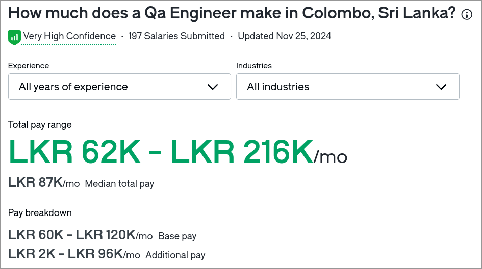

</div>

<!-- column: 1 -->
<div>

## Senior QA Engineer Salary

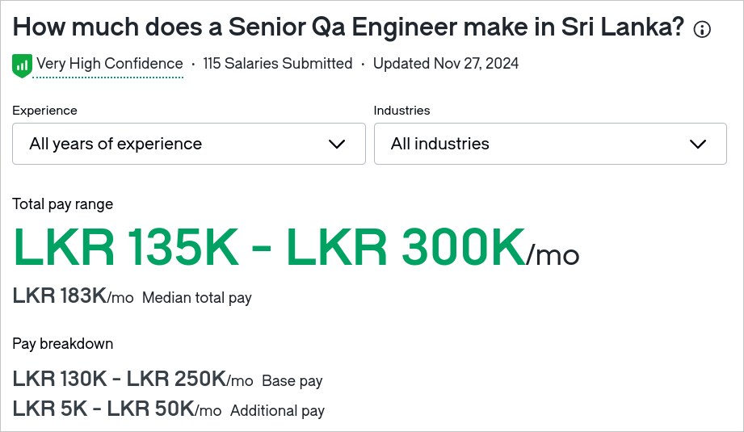

</div>
<!-- reset_layout -->

---

# Final Tips

- Don't be afraid to ask an increment, change in responsibility etc...
- Make sure you’re not staying in one place for too long without growth

---

<!-- jump_to_middle -->
<!-- column_layout: [1, 1, 1] -->
<!-- column: 1 -->

# Questions?

---

# Test Types

<style scoped>
  li {
    font-size: 17px;
  }
</style>

> [!TIP]
> Better to memorize types of test in an interview
> Don't automate everything, but don't do everything manually either
> No company has enough budget to do all these tests

- Unit Tests
- Integration Tests
- Functional Tests
- Regression Tests
- Smoke Tests
- Performance Tests
- Load Tests
- Security Tests
- Acceptance Tests
- End-to-End Tests
- UI Tests
- API Tests
- Visual Regression Tests

---

# Unit Tests (By Developer)

<style scoped>img { width: 70%; }</style>

Purpose: Test individual components or functions of a program to ensure they work as expected.

[source](https://github.com/microsoft/calculator/blob/09a39a500e5b3dd2778df58d8ddc61e652246a24/src/CalculatorUnitTests/DateCalculatorUnitTests.cpp?plain=1#L997-L1017)

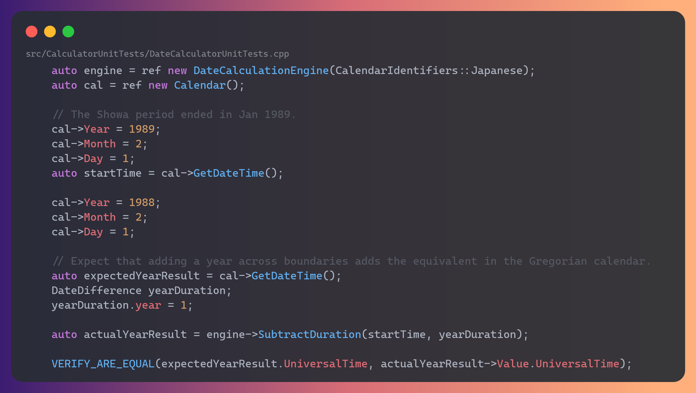

---

# Integration Tests (By Developer)

<style scoped>img { width: 53%; }</style>

Purpose: Verify that different modules or services within an application work together as intended.

[source](https://github.com/neovim/neovim/blob/dde2cc65fd2ac89ad88b19df08dc03cf1da50316/test/functional/plugin/lsp/diagnostic_spec.lua?plain=1#L127-L154)

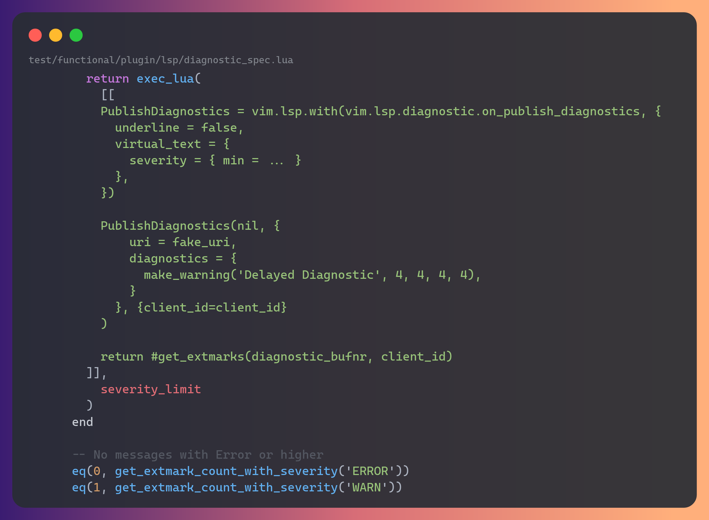

---

# Functional Tests (By QA)

Purpose: Ensure the software behaves according to the specified requirements and that the user’s interactions perform correctly.

---

# Regression Tests (By QA)

Purpose: Verify that new changes or features haven't broken existing functionality.

---

# Smoke Tests (By QA)

Purpose: Perform basic tests to determine if the critical functionalities of the software work after a build or release.

[source](https://github.com/microsoft/vscode/blob/6fb1f6fbdd167ca4599f6ad28323257c3704a777/test/smoke/src/areas/extensions/extensions.test.ts?plain=1#L15-L25)

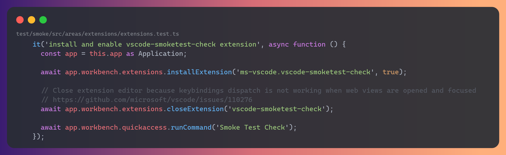

---

# Performance Tests (By QA Maybe)

<style scoped>img { width: 60%; }</style>

Purpose: Evaluate the software’s performance & condition.

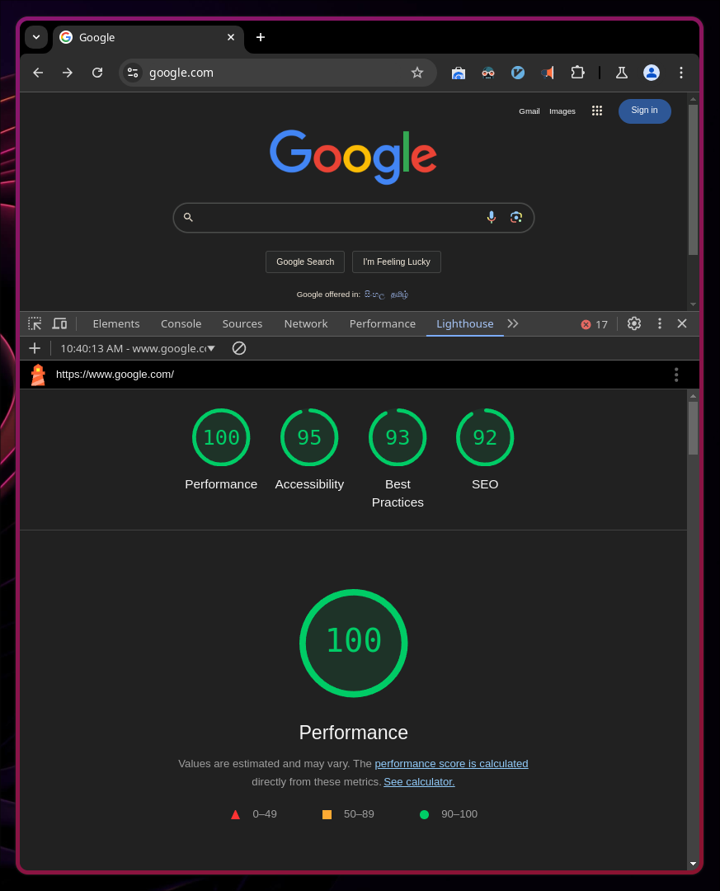

---

# Load Tests (By QA Maybe)

<style scoped>img { width: 30%; }</style>

Purpose: Test how the application performs under normal and heavy load conditions.

[source](https://github.com/antonputra/tutorials/blob/5098b4b9738a920a8a5708f7721faa843449855f/lessons/145/tests/go-app-1.js?plain=1#L4-L31)

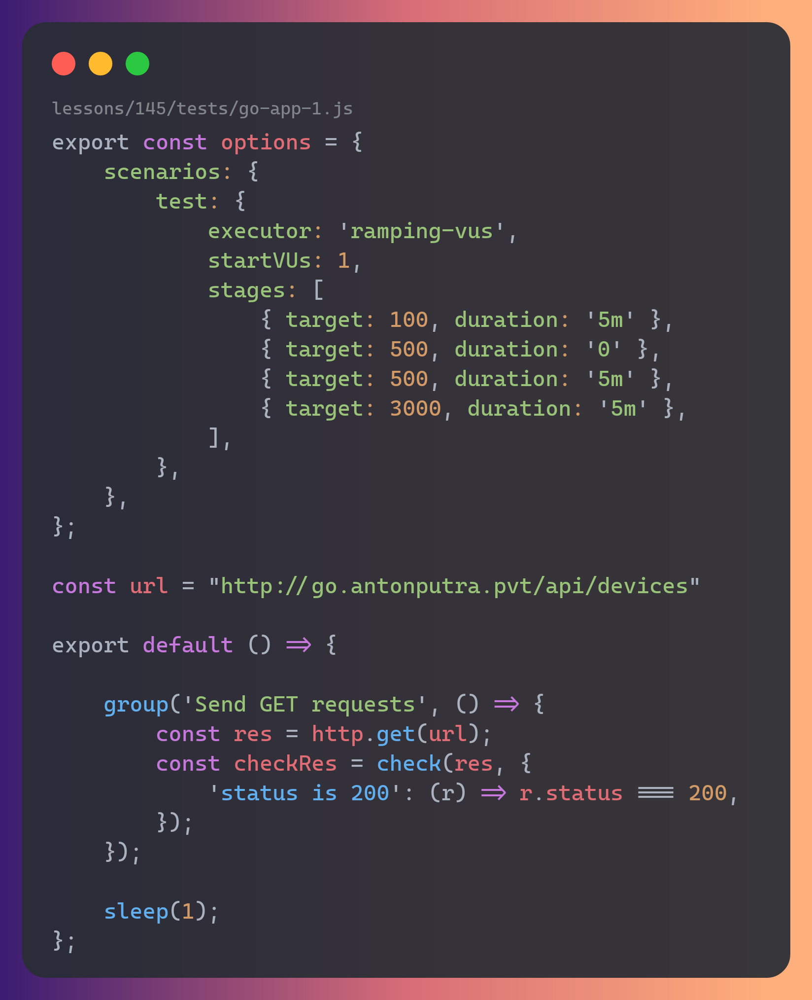

---

# Security Tests (By Security Testers & maybe by QA)

<style scoped>img { width: 60%; }</style>

Purpose: Identify vulnerabilities in the software, ensuring data protection and preventing security breaches.

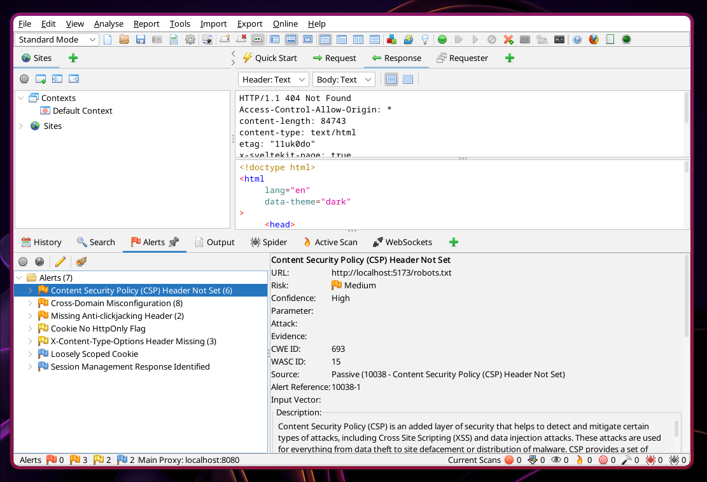

---

# Acceptance Tests (By Client)

Purpose: Validate whether the software meets the client’s requirements and is ready for production.

---

# End-to-End Tests (By QA)

<style scoped>img { width: 55%; }</style>

Purpose: Test the entire application workflow from start to finish to ensure the system works as expected in a production-like environment.

[source](https://github.com/Chocobozzz/PeerTube/blob/0b145cfc9ac2eebd3ca922a7e38cf000e7e75348/client/e2e/src/suites-local/signup.e2e-spec.ts?plain=1#L322-L407)

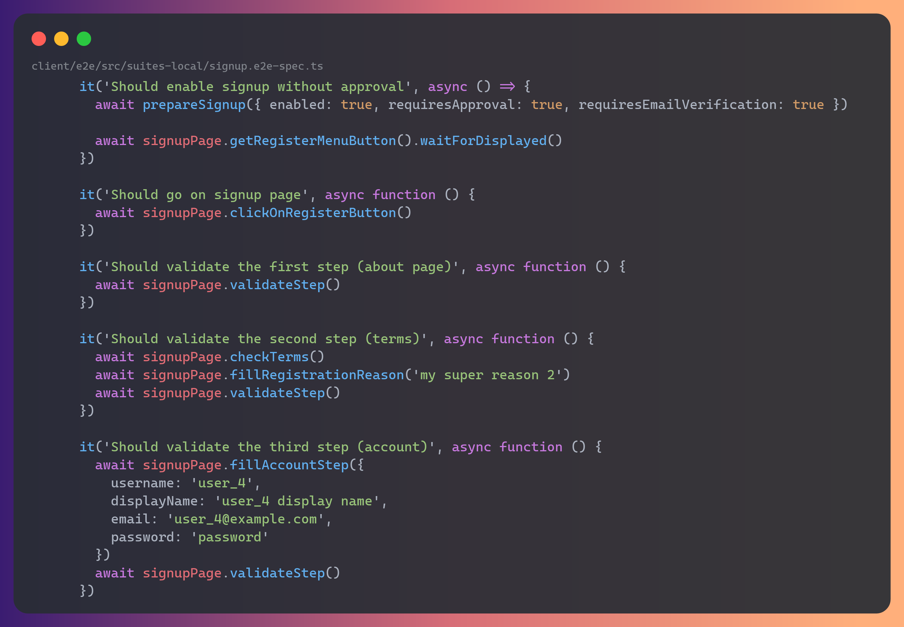

---

# UI Tests (By QA)

<style scoped>img { width: 65%; }</style>

Purpose: Ensure the user interface works as intended, including button clicks, form inputs, and navigation.

[source](https://github.com/meteor/e2e/blob/8e74741f46e14d8918399144fa22692002ebab02/specs/auth/email.js?plain=1#L15-L26)

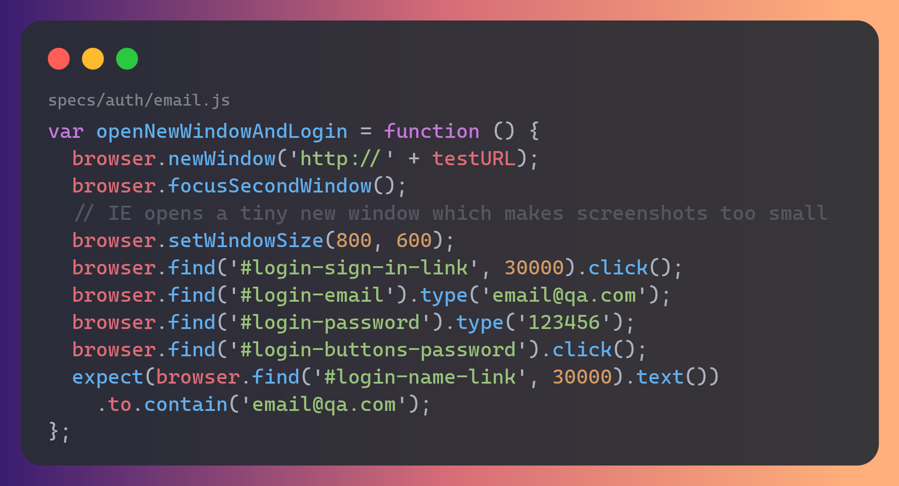

---

# API Tests (By QA)

<style scoped>img { width: 55%; }</style>

Purpose: Validate that APIs return the correct data and handle requests appropriately.

[source](https://github.com/typicode/json-server/blob/6aa56d9581488d9bcd1baf42c4c97b293cd9ee99/src/app.test.ts?plain=1#L109-L128)

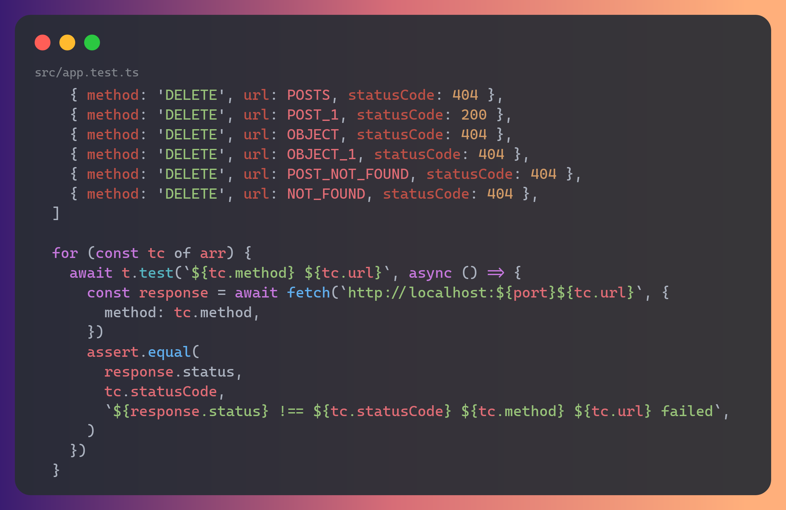

---

# Visual Regression Tests (By QA)

Purpose: Ensure the UI visually appears as intended after updates by comparing screenshots.

[source](https://github.com/rsmbl/Resemble.js/blob/581c1bb757e3fdd7f151c47ad8ca6eafcce5019a/nodejs-tests/compareImages.test.js?plain=1#L9-L23)

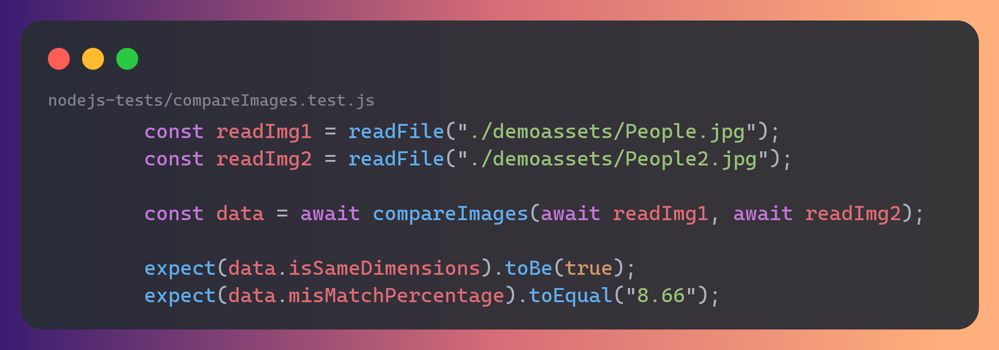

---

<!-- jump_to_middle -->
<!-- column_layout: [1, 1, 1] -->
<!-- column: 1 -->

# Questions?

---

# UI tests

## Why UI testing? (Manual / Automated)

- Validate User Experience
- Cross-Browser and Cross-Device Compatibility
- Detect Visual Defects
- Test Integration with Back-End
- Accessibility Compliance

## Why automated testing

- Speed
- Reusability
- Consistency
- Continuous Integration and Deployment
- Detects regression issues quickly
- Reduces costs in the long run

---

# Popular web UI automation frameworks

| Feature                  | Selenium                      | Cypress          | Playwright        |
| ------------------------ | ----------------------------- | ---------------- | ----------------- |
| Browser support          | ✅✅                          | ✅               | ✅                |
| Language Support         | ✅                            | JS               | Java, Python, JS  |
| Ease of Setup            | ✅                            | ✅               | ✅                |
| Ease of Use              | Hard                          | Easy             | Moderately simple |
| Built-in Debugging Tools | Limited                       | Excellent        | Good              |
| Parallel Execution       | Requires config               | Limited (via CI) | ✅                |
| Released in              | 2004                          | 2017             | 2020              |
| Popularity               | Selenium! selenium everywhere | Ok               | Ok                |
| Stability                | Rock solid                    | Questionable     | Ok                |
| Technology               | Webdriver                     | WebAPI           | CDP               |

---

# Selenium

**tldr;** Instead of using mouse and keyboard to control browser, you call a Selenium function.

> Selenium is a software project that allows you to automate web applications using various browsers

---

## Components of Selenium

ELI5 description

- **Web Driver** - jar file with bunch of classes to automate browser
- **Selenium IDE** - records actions you perform on browser and creates an automation script
- **Selenium Grid** - Run tests remotely

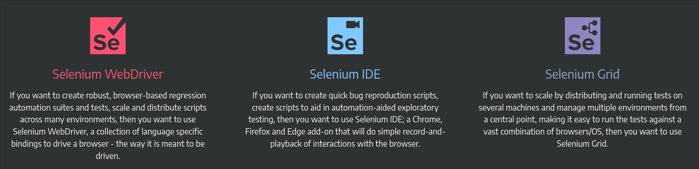

---

## Selenium IDE hands on

> [!NOTE]
> Scripts created by this plugin is pretty terrible
> Not necessarily because it's bad engineering
> It's genuinely a hard problem

- Download and install the [Selenium IDE](https://www.selenium.dev/selenium-ide) (4MB)
- Create a new project
- Start a new recording with [https://demoqa.com/text-box](https://demoqa.com/text-box)
- Export the recorded script to a Java JUnit file

> [!NOTE]
> Generated code is using JUnit 4

---

## Selenium Web Driver hands on

### Pre-requisites

- Java 21
- Gradle 8
- Firefox
- VSCode with **Extension Pack for Java** (or any other Java IDE)

---

## Step 1 - Setting up Java project for test

[changes](https://github.com/s1n7ax/lecture-intro-to-qa-automation/compare/main...step-1)

- Create a new Java project

```bash
gradle init
```

---

## Step 2 - Google page load test

[changes](https://github.com/s1n7ax/lecture-intro-to-qa-automation/compare/step-1...step-2)

- Add selenium as dependency

```groovy
# app/build.gradle
testImplementation 'org.seleniumhq.selenium:selenium-java:4.27.0'
```

- Add a sample test

```java
@Test
void appHasAGreeting() {
  var browser = new FirefoxDriver();
  browser.get("https://www.google.com");

  // this is the test
  assertEquals(browser.getTitle(), "Google");
  browser.close();
}
```

---

## Webdriver classic, WebDriver BiDi

```shell
Dec 21, 2024 9:12:29 AM org.openqa.selenium.firefox.FirefoxDriver <init>
WARNING: CDP support for Firefox is deprecated and will be removed in future versions. Please switch to WebDriver BiDi.
```

### WebDriver classic architecture

<style scoped>img { width: 45%; }</style>

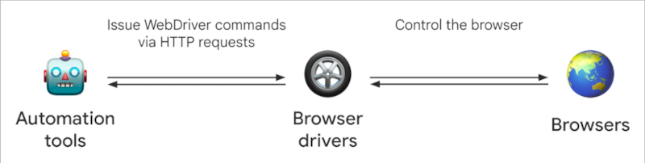

### WebDriver BiDi architecture

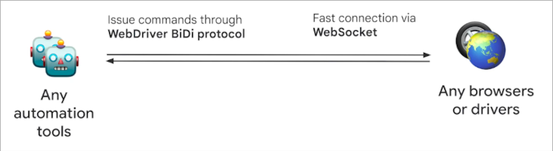

---

### Enable BiDi

#### Chrome

```java
var options = new ChromeOptions();
options.setCapability("webSocketUrl", true);
browser = new ChromeDriver(options);
```

#### Firefox

```java
var options = new FirefoxOptions();
options.setCapability("webSocketUrl", true);
browser = new FirefoxDriver(options);
```

---

## (Off topic) Remove extensions

> [!NOTE]
> While most Selenium commands are included in the specification, some things are browser specific

### On Chrome

```java
var options = new ChromeOptions();
options.addArguments("--disable-extensions");
browser = new ChromeDriver(options);
```

### On Firefox

```java
var options = new FirefoxOptions();
options.addArguments("--safe-mode");
browser = new FirefoxDriver(options);
```

> [!NOTE]
> --safe-mode flag in Firefox disables multiple features including extensions
> Such as Hardware Acceleration & Themes etc

---

## Step 3 - DemoQA form validation

<style scoped>
.cc {
  display: grid;
  grid-template-columns: 3fr 5fr;
  gap: 1rem;
  height: 50%;
}
</style>

[changes](https://github.com/s1n7ax/lecture-intro-to-qa-automation/compare/step-2...step-3)

- Manually check the website [https://demoqa.com/text-box](https://demoqa.com/text-box)
- Inspect the element in the form and output
- Capture the element to execute actions
- Validate the data after submit

<div class="cc">

```java
@BeforeEach
public void beforeEach() {
  var options = new FirefoxOptions();
  options.addArguments("--safe-mode");
  options.setCapability("webSocketUrl", true);
  browser = new FirefoxDriver(options);
}
```

```java
browser.get("https://demoqa.com/text-box");
var pageHeader = browser.findElement(By.tagName("h1"));
assertEquals(pageHeader.getText(), "Text Box");

browser.findElement(By.id("userName")).sendKeys("Srinesh Nisala");
browser.findElement(By.id("userEmail")).sendKeys("random@gmail.com");

var submitBtn = browser.findElement(By.id("submit"));
((JavascriptExecutor) browser).executeScript("arguments[0].scrollIntoView(true);", submitBtn);
submitBtn.click();

var output = browser.findElement(By.id("output"));
var acName = output.findElement(By.id("name")).getText();
var acEmail = output.findElement(By.id("email")).getText();

assertTrue(acName.endsWith("Srinesh Nisala"));
assertTrue(acEmail.endsWith("random@gmail.com"));
```

</div>

---

## Common Exceptions

ELI5 description;

- `NoSuchElementException` - Element you are looking for is not in the webpage. If selector is correct, see if it's inside an iframe
- `StaleElementReferenceException` - Element was there but not right now
- `ElementClickInterceptedException` - Popup probably covering the element or not in the view

> [!TIP]
> Looking for info? Search in [documentation](https://www.selenium.dev/documentation) first
> Then try GPTing it or try Stackoverflow

---

## Step 4 - Page object model design pattern

[changes](https://github.com/s1n7ax/lecture-intro-to-qa-automation/compare/step-3...step-4)

### Why page object model

- Re-usability
- Ease of maintenance
- Better readability and clarity

---

- Create pages from form and form output

<style scoped>
.cc {
  font-size:12px;
}
</style>

<!-- column_layout: [1, 1] -->

<!-- column: 0 -->
<div class="cc">

```java
public class DemoQATextboxPage {
  private WebDriver browser;

  @FindBy(id = "userName")
  private WebElement fullName;

  @FindBy(id = "userEmail")
  private WebElement email;

  @FindBy(id = "submit")
  private WebElement submit;

  DemoQATextboxPage(WebDriver browser) {
    this.browser = browser;
    PageFactory.initElements(browser, this);
  }

  public void fillForm(String fullName, String email) {
    this.fullName.sendKeys(fullName);
    this.email.sendKeys(email);
    ((JavascriptExecutor) this.browser).executeScript("arguments[0].scrollIntoView(true);", this.submit);
    this.submit.click();
  }
}
```

<!-- column: 1 -->

```java
public class DemoQATextboxOutputPage {
  @FindBy(id = "name")
  private WebElement name;

  @FindBy(id = "email")
  private WebElement email;

  DemoQATextboxOutputPage(WebDriver browser) {
    var output = browser.findElement(By.id("output"));
    PageFactory.initElements(output, this);
  }

  public void validateForm(String expFullName, String expEmail) {
    assertTrue(this.name.getText().endsWith(expFullName));
    assertTrue(this.email.getText().endsWith(expEmail));
  }
}
```

</div>

---

# Step 5 - Data driven testing

<style scoped>
marp-pre {
  font-size: 16px;
}
</style>

(changes)[https://github.com/s1n7ax/lecture-intro-to-qa-automation/compare/step-4...step-5]

Data-Driven Testing (DDT) is a software testing methodology in which test scripts execute a set of test cases using different sets of input data.

> [!NOTE]
> The following example demonstrates how to supply different data sets to tests, which is a crucial aspect of data-driven testing. However, it does not address handling varying scenarios based on the input data

```java
@ParameterizedTest
@ValueSource(strings = { "Srinesh,srinesh@email.com", "Nisala,nisala@email.com" })
void test(String detils) {
  browser.get("https://demoqa.com/text-box");

  var splitDetails = detils.split(",");
  var fullName = splitDetails[0];
  var email = splitDetails[1];

  DemoQATextboxPage.init(browser).fillForm(fullName, email);
  DemoQATextboxOutputPage.init(browser).validateForm(fullName, email);
}
```

---

# Step 6 - Headless mode

(changes)[https://github.com/s1n7ax/lecture-intro-to-qa-automation/compare/step-5...step-6]

### Chrome

```java
var options = new ChromeOptions();
options.addArguments("--headless=new");
browser = new ChromeDriver(options);
```

### Firefox

```java
var options = new FirefoxOptions();
options.addArguments("--headless");
browser = new FirefoxDriver(options);
```

---

# Questions?
