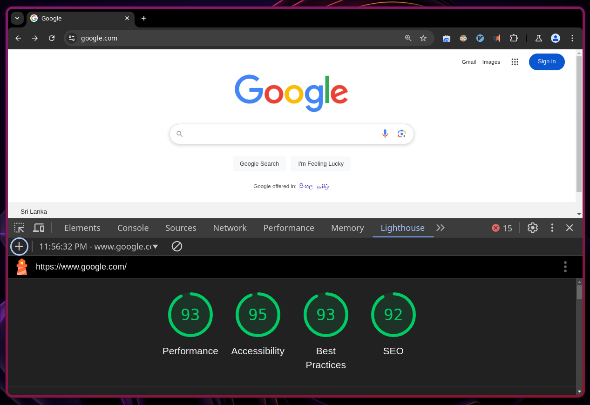

# I'm Srinesh Nisala

- Senior software engineer at Orli tech
- You can find me on these platforms
  - [github.com/s1n7ax](https://github.com/s1n7ax)
  - [linkedin.com/in/srinesh-nisala](https://www.linkedin.com/in/srinesh-nisala)
  - [s1n7ax.com](https://s1n7ax.com)

---

# Heads up

- This is my first time giving a lecture, so I hope you'll be patient with me!
- This includes my opinion + experience and some of the things might be
  different from the theory you have learnt
- My English is ok but it gets worse over long period of time XD

---

# Job Designations

> [!TIP]
> The most common job title in Sri Lanka is _"QA Engineer"_, but you might see _"Software Engineer in Test"_ job title by some foreign companies

> [!TIP]
> If a job vacancy is titled _"QA Engineer"_, it likely indicates they are seeking someone proficient in both manual and automated testing

> [!TIP]
> If the job vacancy specifies _"QA Automation Engineer"_, your primary focus will likely be on automation tasks

- **Manual QA Engineer** - _No programming knowledge needed_
- **QA Automation Engineer** - _Need basic programming knowledge_
- **Software Developer** - _Need good programming knowledge_

---

# Salaries of QAs & Senior QAs

> [!TIP]
> If you’ve got what it takes, why not start your own company and be an entrepreneur

> [!NOTE]
> Salary varies based on various different things
>
> - Your performance & skills
> - Experience
> - \* Designation \*
> - Based on the company
> - Company politics (You could see this in very few work places)

<!-- column_layout: [1, 1] -->

<!-- column: 0 -->

## QA Engineer Salary

<!-- column: 1 -->

## Senior QA Engineer Salary

<!-- reset_layout -->

---

# Final Tips

- Don't be afraid to ask an increment
- Make sure you’re not staying in one place for too long without growth

---

# Test types

> [!TIP]
> Strike a balance — don't automate everything, but don't do everything manually either.

> [!NOTE]
> There may not be strict guidelines on who is responsible for which tests

- Unit Tests
- Integration Tests
- Functional Tests
- Regression Tests
- Smoke Tests
- Performance Tests
- Load Tests
- Security Tests
- Acceptance Tests
- End-to-End Tests
- UI Tests
- API Tests
- Visual Regression Tests

---

# Unit Tests (By Developer)

Purpose: Test individual components or functions of a program to ensure they work as expected.
Tools: JUnit, Vitest, pytest.

[source](https://github.com/microsoft/calculator/blob/09a39a500e5b3dd2778df58d8ddc61e652246a24/src/CalculatorUnitTests/DateCalculatorUnitTests.cpp?plain=1#L997-L1017)

---

# Integration Tests (By Developer)

Purpose: Verify that different modules or services within an application work together as intended.
Tools: Postman, REST-assured

[source](https://github.com/neovim/neovim/blob/dde2cc65fd2ac89ad88b19df08dc03cf1da50316/test/functional/plugin/lsp/diagnostic_spec.lua?plain=1#L127-L154)

---

# Functional Tests (By QA)

Purpose: Ensure the software behaves according to the specified requirements and that the user’s interactions perform correctly.
Example: Checking that a user can successfully log in using correct credentials.
Tools: Selenium, Cypress, Playwright.

---

# Regression Tests (By QA)

Purpose: Verify that new changes or features haven't broken existing functionality.
Example: Ensuring that a new feature doesn’t interfere with previous features like login, search, etc.
Tools: Selenium, TestComplete, QTP.

---

# Smoke Tests (By QA)

Purpose: Perform basic tests to determine if the critical functionalities of the software work after a build or release.

[source](https://github.com/microsoft/vscode/blob/6fb1f6fbdd167ca4599f6ad28323257c3704a777/test/smoke/src/areas/extensions/extensions.test.ts?plain=1#L15-L25)

---

# Performance Tests (By QA Maybe)

Purpose: Evaluate the software’s performance & condition.

---

# Load Tests (By QA Maybe)

Purpose: Test how the application performs under normal and heavy load conditions.
Example: Assessing how many users a website can handle at once without crashing.
Tools: Apache JMeter, BlazeMeter, LoadRunner.

[source](https://github.com/antonputra/tutorials/blob/5098b4b9738a920a8a5708f7721faa843449855f/lessons/145/tests/go-app-1.js?plain=1#L4-L31)

---

# Security Tests (By Security Testers & maybe by QA)

Purpose: Identify vulnerabilities in the software, ensuring data protection and preventing security breaches.

---

# Acceptance Tests (By Client)

Purpose: Validate whether the software meets the client’s requirements and is ready for production.

---

# End-to-End Tests (By QA)

Purpose: Test the entire application workflow from start to finish to ensure the system works as expected in a production-like environment.

[source](https://github.com/Chocobozzz/PeerTube/blob/0b145cfc9ac2eebd3ca922a7e38cf000e7e75348/client/e2e/src/suites-local/signup.e2e-spec.ts?plain=1#L322-L407)

---

# UI Tests (By QA)

Purpose: Ensure the user interface works as intended, including button clicks, form inputs, and navigation.
Example: Verifying that a "Submit" button works after entering data in a form.
Tools: Selenium, Cypress, TestCafe.

---

# API Tests (By QA)

Purpose: Validate that APIs return the correct data and handle requests appropriately.
Example: Ensuring a weather API returns accurate weather data based on the requested parameters.
Tools: Postman, RestAssured, SoapUI.

[source](https://github.com/typicode/json-server/blob/6aa56d9581488d9bcd1baf42c4c97b293cd9ee99/src/app.test.ts?plain=1#L109-L128)

---

# Visual Regression Tests (By QA)

Purpose: Ensure the UI visually appears as intended after updates by comparing screenshots.

[source](https://github.com/rsmbl/Resemble.js/blob/581c1bb757e3fdd7f151c47ad8ca6eafcce5019a/nodejs-tests/compareImages.test.js?plain=1#L9-L23)

